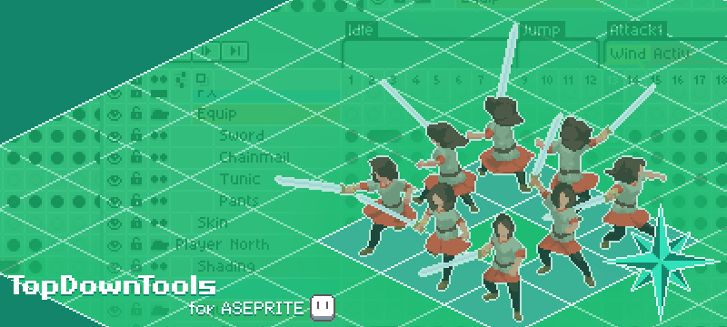

# TopDownTools

An [Aseprite](https://www.aseprite.org/) extension to automate repetitive tasks when organizing directional sprites for top-down or isometric games and for other kinds of projects as well. Click [**here**](https://www.youtube.com/watch?v=ueuYmWoUgbM) to watch a demo of some of these tools in use.

### Contents
  * [Main Features](#main-features)
    + [Merge Open Sprites](#merge-open-sprites)
    + [Directional Sprites Support](#support-for-directional-sprites)
    + [Re-Link All Cels](#re-link-all-cels)
    + [Fan Out Layers](#spread-your-wings-layers)
    + [Extras](#extras)
  * [Demos](/docs/pages/Demos.md#topdowntools-demos)
  * [Installation](#installation)
  * [Change Log](#change-log)
  * [Credits](#credits)

## Main Features

>**Make sure to always save or back-up your files before using this extension!** Also note that it has partial support for `Aseprite 1.3-beta`.

[Simple](/docs/pages/Merge-Simple.md#simple-merge) and [Advanced](/docs/pages/Merge-Advanced.md#advanced-merge) sprite merge tools to import multiple files, with support for [directional sprites](/docs/pages/Merge-DirectionPresets.md#direction-name-presets) (with limited [CLI support](/docs/pages/Merge-Script-Interface.md#script-interface) as well). [Spread out](/docs/pages/Layers-FanOut.md#fan-out-layers) multiple frames in many layers to set up a sprite sheet. Force [re-link cels](/docs/pages/Relink-RelinkCels.md#re-link-all-cels), plus a few other [extras](#extras). 

Head over to the **[Demos](/docs/pages/Demos.md#topdowntools-demos)** page to check all the tools in action.

### Merge Open Sprites
Automate your `.ase` `.aseprite` file import process instead of manually copying all layers and frames from different files.

+ Use the [**Simple Merge** tool](/docs/pages/Merge-Simple.md#simple-merge) to import all the frames in your files as a sequence. You can tag each imported sprite automatically and import their individual tags.

+ Use the [**Advanced Merge** tool](/docs/pages/Merge-Advanced.md#advanced-merge) to automatically copy your files and import their whole layer structure, down to blend modes, layer names, properties, tags, frame rates, etc. 

You could also run a simplified version of the merge script on your [Command-Line Interface (CLI)](/docs/pages/Merge-Script-Interface.md#script-interface) batch file and call it with `--script`.

### Support for Directional Sprites
If you're creating assets in multiple directions you can create [**Direction Name Presets**](/docs/pages/Merge-DirectionPresets.md#direction-name-presets) to parse your direction names during the import process. You can automatically rename your layers and add tags with these direction names if you want to.

### Re-Link All Cels
If your sprites have identical cels but for whatever reason they are not properly linked you can use the [**Re-Link All Cels** tool](/docs/pages/Relink-RelinkCels.md#re-link-all-cels) to turn them into linked cels.

### Spread your ~~Wings~~ Layers
Use the [**Fan Out** tool](/docs/pages/Layers-FanOut.md#fan-out-layers) to automatically move the frames in a layer/group evenly across the timeline, extending their tags, copying their frame rates, etc. It could be useful when you're putting together animation sequences or when exporting a sprite sheet.

### Extras
Some other neat features included in this extension are: [**Bulk Rename Layers**](/docs/pages/Layers-BulkRename.md#bulk-rename-layers) to rename multiple layers at once, [**Extend Background Frames**](/docs/pages/Extras-ExtendBackground.md#extend-background) to solve a small quirk when using a Background layer, [**Import Slices**](/docs/pages/Extras-ImportSlices.md#import-slices) (Experimental!) to import the slices from another sprite. 

## Installation

1. Download the extension from ???????
2. Double-click the `.aseprite-extension` file to install  
	+ You may need to add it manually in  `Edit -> Preferences -> Extensions -> Add Extension`
3. You're done!

## Change Log
+ Version 1.0 released!

## Credits
+ Making sense of Aseprite plug-ins thanks to [Extension Base](https://github.com/david-fletcher/extension-base) by [David Fletcher](https://github.com/david-fletcher). 
+ Some common/layer functions adapted from [Gaspi](https://gaspi.itch.io/)'s [Export Layers](https://gist.github.com/PKGaspi/5c4c43f060d633369b9447ae21cc4491) script.
+ Some of the sprites and assets shown in the demos created by [samsmie](https://blendswap.com/blend/28479), [Pixel Frog](https://pixelfrog-assets.itch.io/pirate-bomb), [greatdocbrown](https://greatdocbrown.itch.io/gamepad-ui).