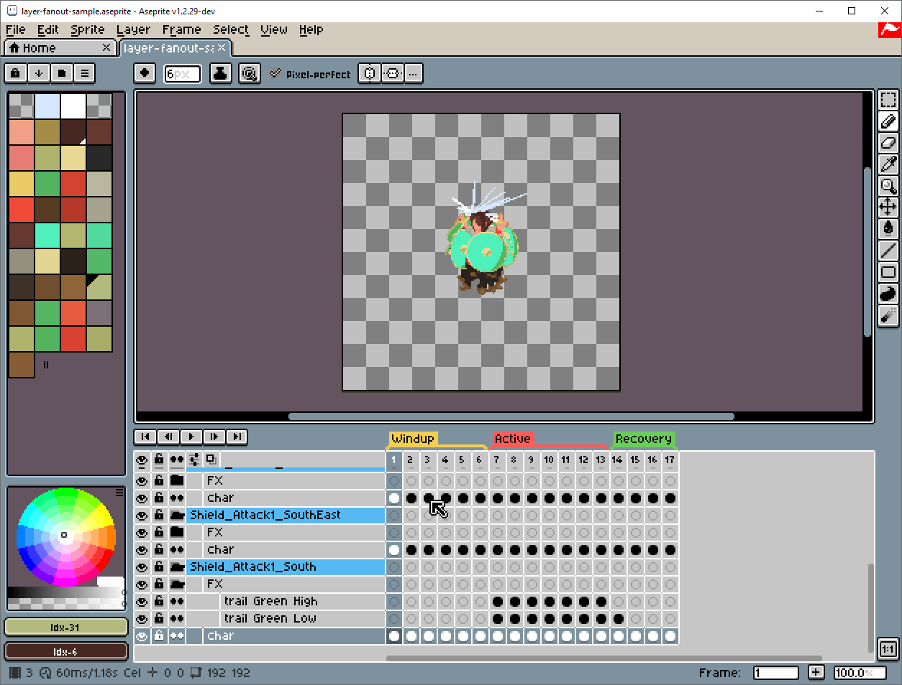
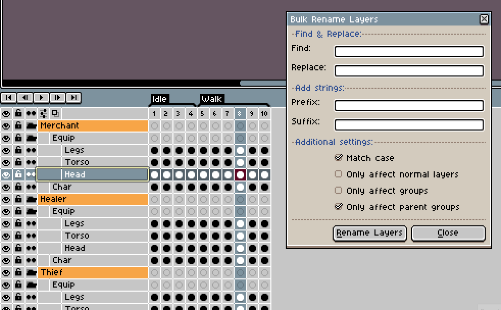
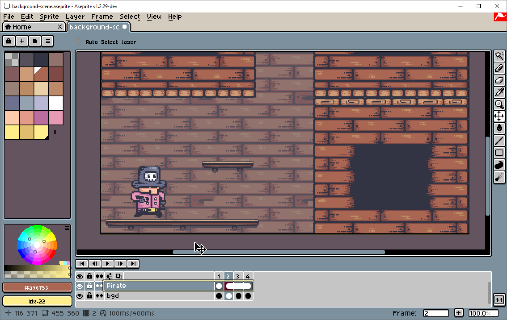

# TopDownTools Demos

## [Simple Merge](Merge-Simple.md#simple-merge)

*Original 3D model sourced from [The Adventure Zone: Merle Highchurch](https://blendswap.com/blend/28479) by [samsmie](https://blendswap.com/profile/371778).*

## [Advanced Merge](Merge-Advanced.md#advanced-merge) workflow
[Watch demo in YouTube](https://www.youtube.com/watch?v=ueuYmWoUgbM)

## [Fan Out Layers](Layers-FanOut.md#fan-out-layers)

+ [Fan Out and Flatten](./demos/Demo-Layers-FanOutFlat.md#fan-out-layers-with-flatten-layers-enabled)

## [Re-Link Cels](Relink-RelinkCels.md#re-link-all-cels)

*Sample assets created by [Pixel Frog](https://pixelfrog-assets.itch.io/pirate-bomb).*

## [Bulk Rename Layers](Layers-BulkRename.md#bulk-rename-layers)

## [Import Slices](Extras-ImportSlices.md#import-slices) (Experimental)

*Sample sprites from [Gamepad UI / Controller Prompts Pack](https://greatdocbrown.itch.io/gamepad-ui) by [greatdocbrown](https://greatdocbrown.itch.io/).*

## [Extend Background](Extras-ExtendBackground.md#extend-background)

*Sample assets created by [Pixel Frog](https://pixelfrog-assets.itch.io/pirate-bomb).*
