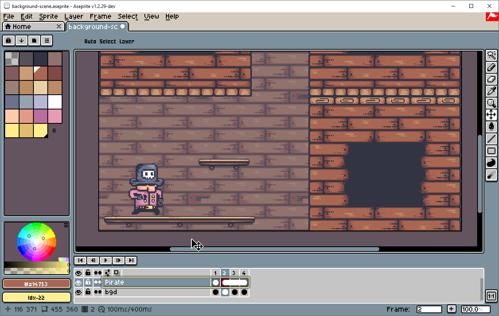

# Extend Background

This small extra feature tries to solve one of Aseprite's quirks when your sprite has a [background layer](https://www.aseprite.org/docs/layers/#background-layer) and you need to add frames to the sprite. You might find it useful or not.

Sometimes you just want to have the same repeating background for every single frame in your animation. By default, a background layer is not [continuous](https://www.aseprite.org/docs/continuous-layers/). If you add a new empty frame at some point in the timeline, or copy-paste frames that add new frames to the sprite, the background layer's cels corresponding to the new frame(s) will be blank, filled with the color you currently have selected as your background color. **This occurs even if you have previously set up your background layer to continuous.** 

To fix this small issue, you'd have to select the background layer, select the previous frame which has the image you want to extend, and copy-paste it over and over to replace those blank images.

You can automate this process with this tool:
1. Select a single frame in the **Background** layer that has the image you want to extend.
2. Right-click it.
3. Click `Replace/Link Background Cels`.
4. You're done!

If you add new frames to it, repeat the above steps.

>What this tool does is set the Background layer to continuous, takes the selected cel and copy-pastes it across all frames in the Background layer.

Note that this will replace all frames in the Background layer with the selected cel, so be careful! 

### Demo

*Sample assets created by [Pixel Frog](https://pixelfrog-assets.itch.io/pirate-bomb).*
