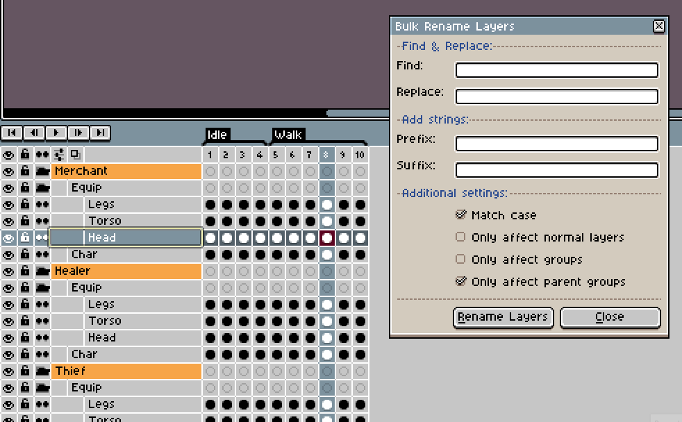
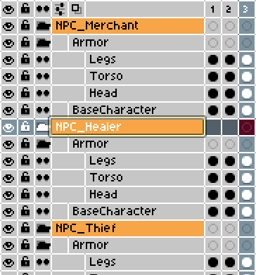

# Bulk Rename Layers
A basic Find and Replace feature for renaming a sprite's layers.

It can be accessed through `Layers -> Bulk Rename Layers`

### Demo

## Additional Settings:
+ **Match case:** If enabled, performs a case-sensitive find/replace.

+ **Only affect normal layers:** If enabled, it will rename every layer in the sprite that is not a group.

+ **Only affect groups:** If enabled, it will only rename groups, ignoring normal layers.

+ **Only affect parent groups:** If enabled, it will only affect groups at the base layer depth. Subgroups will not be modified.

*Parent groups are colored in orange.*