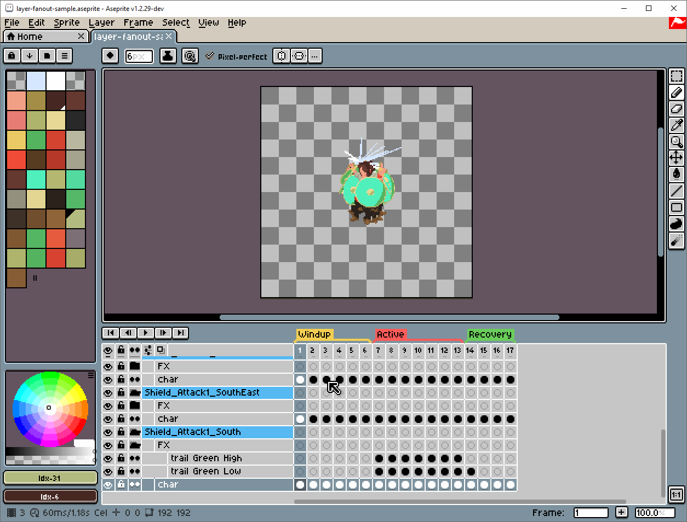

# Fan Out Layers
Takes each layer or group in a sprite and spreads them in the timeline, keeping grouped layers together along with other tag related features.

It can be accessed through the top menu in `Layer -> Fan Out Layers`.

Note that if the sprite has a [background layer](https://www.aseprite.org/docs/layers/#background-layer) it will not be considered when moving each layer stack. The background may also end up with empty blank frames, which you may want to fix manually or with the [Extend Background](Extras-ExtendBackground.md#extend-background) tool.

### Demo

## Fan Out settings
+ **Move only visible layer/groups:** If enabled, it will ignore hidden layers and groups. These will remain at their original position.

+ **Copy frame rate from the base stack:** Each new frame will have the same frame rate it originally had in the base stack.

+ **Flatten layers:** Automatically flattens all layers/groups leaving a single layer named `Flattened`. Similar to doing `Layer -> Flatten`. Watch a demo of this process [here](./demos/Demo-Layers-FanOutFlat.md#fan-out-layers-with-flatten-layers-enabled).

+ **Flatten visible layers:** Similar to the above **Flatten layers** option, except it will only affect visible layers. Similar to doing `Layer -> Flatten Visible`.

+ **Add delimiting tags:** Takes the name of the layer or group to be moved and adds a new tag with that layer/group name. The tag will appear around the layer's new position in the timeline.

+ **Extend tags from the base stack:** If the sprite already has tags, you can extend these tags for each moved layer. It will copy each tag's attributes (name, color, direction).

### Extend Tags additional settings:
If you want, you can rename the original tag names adding the layer or group name as a prefix or a suffix, specifying a separator character, like `_` (underscore). Otherwise, the extended tags will retain their original names.