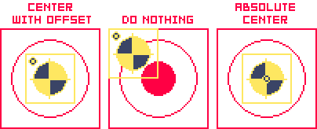

# Advanced Merge

This feature allows you to import every sprite currently open in Aseprite into a single new sprite based on different settings. If you're working with [linked cels](https://www.aseprite.org/docs/linked-cels/), remember to the [Re-Link All Cels](Relink-RelinkCels.md#re-link-all-cels) tool afterwards.

>**NOTE:** This tool has partial support for some `Aseprite 1.3-beta` specific features, like [Tilemaps](https://www.aseprite.org/docs/tilemap/).

You can access it from `File -> Merge Open Sprites (Advanced)`.

### Demo
Watch a demo of the tool in action [here](https://www.youtube.com/watch?v=ueuYmWoUgbM) (YouTube).

----
### A Note about Indexed sprites
If the source sprites to be merged are [Indexed](https://www.aseprite.org/docs/color-mode/#indexed) and all have the exact same palette (both in size and color order) the resulting new sprite will import that palette and you probably won't have to do anything else. 

However, if some of the colors or their indices don't match across every palette, or if some of the sprites are not indexed while others are, the resulting new sprite will not be Indexed and will have a blank palette. You can later import or create a palette manually and set the new sprite to Indexed mode.

## Import Mode

### Sequence (Fanned out)
Copies every frame from each source sprite and places them one after another in a sequence.

>**Example:** `NPC_Idle` has 4 frames. `NPC_Run` has 8 frames. 
The merged sprite will have 12 frames in total. Frames from `NPC_Idle` will be copied to frames `1 -> 4`,  `NPC_Run`'s will appear in frames `5 -> 12`.

### Stacked layers (Fold sprites)
Copies every frame from the source sprites and places them in separate layers (or layer groups), all starting at frame `1`. The number of frames in the new sprite is determined by the source sprite with the most frames.

>**Example:** `NPC_Idle`, `NPC_Run`, `NPC_Attack` have 4, 8 and 10 frames respectively.
>The first layer in the new sprite will correspond to `NPC_Idle` and will have 4 frames (`1 -> 4`) . The second layer will have 8 frames (`1 -> 8`) corresponding to `NPC_Run`. The third layer will have 10 frames (`1 -> 10`) corresponding to `NPC_Attack`.

## Canvas Size settings

When importing sprites with different dimensions, the canvas size of the new sprite will be enlarged to accommodate all the source sprites. The Canvas Size panel allows you to change the position of the smaller source sprites: 

+ **Center with offset:** Center the imported images but, visually, the different shapes will retain their original offset.
+ **Do nothing:** The imported images will be positioned around the top left corner `(x=0, y=0)`.
+ **Absolute center:** Centers the images on each cel/frame ignoring their original positions (only available if [Import layer structure](#import-layer-structure) is enabled).

  
Click to show an illustrative example

 
+ Sprite A (32x32):

+ Sprite B (64x64):

+ Merge results:

Note that this panel will not appear if all the source sprites share the same dimensions.

## Layer settings

### Import into a single layer
Every source sprite will be imported into a single layer as a flattened image (note that transparency is supported). This setting is only available while using the [Sequence](#sequence-fanned-out) import mode.

### Import into separate layers
Every sprite will be imported to its own layer or group of layers. This setting is **required** when using the [Stacked layers](#stacked-layers-fold-sprites) import mode. 

## Layer Structure settings

### Flatten sprite layers
Use this option to import the frames from the source sprites as a flat image. It's similar to doing `Select All` and then `Edit -> Copy Merged` for each frame, pasting it into a new file, then repeating the process for the remaining frames for each source sprite. 

If some of the source sprites are indexed and have different palettes, it will automatically copy the frames as RGB and the new sprite will have a blank palette (see related [Note](#a-note-about-indexed-sprites) for more details).

### Import layer structure
Copies the layer structure from the source sprites into a group for each individual source sprite. The imported layers will retain their original names. 

>**NOTE:** Do not enable this option if your source sprites contain [Tilemaps](https://www.aseprite.org/docs/tilemap/) because the application might freeze or crash. Remember to always save your sprites!

It also copies the following attributes from the source layers: 
- blend mode, layer opacity, groups and sublayers, layer settings (visible, locked, continuous), timeline UI color and user data.

Additionally, the imported cels will retain their original opacity, user data and timeline UI colors. 

If all the source sprites are indexed and have consistent color palettes, the new sprite will be indexed and have the palette found in any of the source sprites. The extension will ask you how you want to proceed if the color mode or the palettes are not consistent across all sprites (see related [Note](#a-note-about-indexed-sprites) for more details).

#### Additional Layer Structure settings:
+ **Only visible layers:** Copies only the visible layers / visible groups from each source sprite.
+ **Ignore background layers:** Enable this option if the sprites have a [background layer](https://www.aseprite.org/docs/layers/#background-layer) and you don't want to import them. Otherwise, the background layers will be imported into the new sprite as a regular layer with the name `Background` inside each source sprite group.

>**NOTE:** As of writing this (Aseprite `version 1.2.29`), Reference layers will also be copied over because the [API](https://github.com/aseprite/api) can't tell them apart from normal layers. This is scheduled to change in a [future version of Aseprite](https://github.com/aseprite/aseprite/pull/2988). If you want to ignore them, hide the reference layers and use the **Only visible layers** setting.

### Group merged sprites
Creates a group for each source sprite. This is an optional setting if you're using the [Flatten sprite layers](#flatten-sprite-layers) option, but is required when [Importing layer structure](#import-layer-structure).

## Additional settings

### Sort sprites by filename
By default, the source sprites will be processed in whatever order they were opened in Aseprite. If this setting is enabled, the extension will attempt to alphabetically sort the sprites by filename and will process them in that order. 

### Sort sprites by directions
Moreover, if the source sprites contain a direction name in their respective filenames and you are using a [**Direction preset**](Merge-DirectionPresets.md#direction-name-presets), the sprites can be optionally sorted alphabetically by filename AND by the order in which the directions are listed in the preset. This means you can use the **Direction names feature** to further customize the order in which the sprites should be sorted.

**Example:**

  
Click to show a sprite sorting example

  	<table>
	<thead><tr><th></th><th>Random order</th><th>Alphabetical Simple</th><th>Alphabetical w/Direction Preset*</th></tr></thead><tbody>
	<tr><td>1</td><td>Archer Down.ase</td><td>Archer Down.ase</td><td>Archer Down.ase</td></tr>
	<tr><td>2</td><td>Archer Up.ase</td><td>Archer Left.ase</td><td>Archer Right.ase</td></tr>
	<tr><td>3</td><td>Warrior Up.ase</td><td>Archer Right.ase</td><td>Archer Up.ase</td></tr>
	<tr><td>4</td><td>Warrior Down.ase</td><td>Archer Up.ase</td><td>Archer Left.ase</td></tr>
	<tr><td>5</td><td>Archer Left.ase</td><td>Warrior Down.ase</td><td>Warrior Down.ase</td></tr>
	<tr><td>6</td><td>Archer Right.ase</td><td>Warrior Left.ase</td><td>Warrior Right.ase</td></tr>
	<tr><td>7</td><td>Warrior Right.ase</td><td>Warrior Right.ase</td><td>Warrior Up.ase</td></tr>
	<tr><td>8</td><td>Warrior Left.ase</td><td>Warrior Up.ase</td><td>Warrior Left.ase</td></tr>
	</tbody>
	</table>

(*) The preset used in this example lists its direction names in the following order: `Down, Right, Up, Left` (counter-clockwise starting from Down/South). 

### Copy framerate
 This option allows you to copy the framerate of each individual frame from the source sprites and is useful mostly when all the source sprites have the same number of frames and consistent framerates, or when importing the sprites as a [Sequence](#sequence-fanned-out).

Note that if you use the [Stacked layers](#stacked-layers-fold-sprites) import mode and you import multiple sprites with different frame numbers and/or inconsistent framerates, the frames in the new sprite will have varying framerates based on the order the sprites were imported in (as each sprite will overwrite the framerate set by the previous sprite).

### Add Delimiting Tags
Adds [tags](https://www.aseprite.org/docs/tags/) to the new sprite to show where each source sprite is in the timeline. You can customize the names of these tags in the [Customize Names](#customize-names-settings) tab of the Advanced Merge dialog. This option is only supported in the [Sequence](#sequence-fanned-out) import mode (otherwise, the new sprite could have *n* number of nested tags all placed around the same frames).

### Import Tags
Copies every [tag](https://www.aseprite.org/docs/tags/) found in each source sprite into the new sprite. It copies tag names, tag colors and animation directions. Note that if you use the [Sequence](#sequence-fanned-out) import mode, the imported tags should be moved to the frames that correspond to that specific source sprite.

You can further [customize the names of the imported tags](#add-new-names-to-imported-tags) in the [Customize Names](#customize-names-settings) tab by adding a prefix or a suffix corresponding to the source sprite's file title (or a custom name). For example, a tag named `Crouch` found in the sprite `Player_Movement` can be renamed to `Player_Movement_Crouch` in the new sprite.

## Customize Names settings

In this tab you can customize the names of the layers and/or tags of the new sprite. This affects layer names and/or parent groups (when [importing into separate layers](#import-into-separate-layers)), delimiting tag names (when [adding tags to delimit the imported sprites](#add-delimiting-tags)) and, optionally, imported tag names (when [importing tags](#import-tags)).

Your imported sprites can have layer or tag names independent of their actual filenames which may help ease your [sprite sheet](https://www.aseprite.org/docs/sprite-sheet/) exporting process via UI/[CLI](https://www.aseprite.org/docs/cli/), or integration with other tools or game engines with Aseprite file support. Click the **Preview Layer/Delimiting Tag Names** button to check how your imported sprites will be named.

>**NOTE:** This tool has limited filename parsing capabilities and it greatly depends on how consistently your sprites are named. It's recommended to prepare your files outside Aseprite before using this extension as you can have much more control using bulk rename utilities. Keep a consistent naming convention across your sprites for better results.

### Name layers/tags with sprite filenames
Parses the filenames to produce the new names for layers/groups/delimiting tags in the new sprite. These options can be combined.
+ **Remove frame numbers:** If you're importing sprites from different frame sequences you can remove the trailing frame numbers. 
	+ Ex: `[NPC_Healer_64x64_Pos3_0001] -> [NPC_Healer_64x64_Pos3]`
+ **Find and Replace a string:** Case-sensitive!
	+ Ex: `[Player_Attack2_v3_...] -> [Player_ChargedAttack_...]` 
+ **Add a prefix/suffix:** Add a custom string to the existing filenames at the beginning or at the end. 
	+ Ex: `[WaterLevel_destructibles] -> [World3_WaterLevel_destructibles]`

### Name layers/tags with a custom name
Ignores the source filenames and uses this string for all imported sprites. Probably more helpful when combined with a direction preset. You can specify an additional character or string to use as a separator.

### Name layers/tags with a [direction name](Merge-DirectionPresets.md#direction-name-presets)
This feature's utility shines when creating directional sprites for top down or isometric games. It uses the direction codes/names found in the filenames and tries to match them with the strings of a [Direction preset](Merge-DirectionPresets.md#direction-name-presets). 

The extension comes with a few [default presets](Merge-DirectionPresets.md#default-direction-presets) but you can create and [customize your own based](Merge-DirectionPresets.md#custom-direction-presets) on your file naming or project settings. 

>**NOTE:** A *direction* can be a simple **short code** (Ex: `E, N, W, S` for the cardinal directions), a **long name** (Ex: `Down, Up, Right, Left`) or a combination of both, i.e., a **mixed naming convention** (Ex: `SE` for `South-East`).

There are 3 possible sub-modes depending on whether you've enabled a second naming setting:
+ **Rename direction in sprite filenames with preset values:** If you're using the [filenames](#name-layerstags-with-sprite-filenames), it can find and replace the short code in the files with a long name. 
	+ Ex: `[Player_Run_D] -> [Player_Run_Down]`
+ **Append direction name as suffix:** If you're using a [custom string](#name-layerstags-with-a-custom-name) as layer/tag names, it adds the direction as a suffix. You can specify a character or string to use as a separator.
	+  Ex: `[Player_Run_64x64_S_0001] -> [RunAnimation-South]`
+ **Name with a direction:** Only use the direction preset's short code or long name as layer/tag names.
	+ Ex: `[Player_Run_D] -> [D]` (short codes only). 
	+ Ex: `[Player_Run_D] -> [Down]` (short codes AND long names).

### Add New Names to Imported Tags
This optional feature allows you to add the names you've set up with the above settings as a prefix or a suffix for the imported tags. You can specify a character or string to use as a separator.
___

### Remember Settings
Saves the merge settings to `lastMergeSession.lua` inside the TopDownTools directory:
+ Path: `C:\Users\USERNAME\AppData\Roaming\Aseprite\extensions\topdown-tools\merge`

You can load these saved settings as a template to further modify your merge process or to repeat the last merge (Note that the file will be overwritten by subsequent merges if you leave the checkbox enabled).