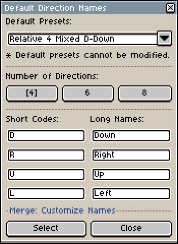
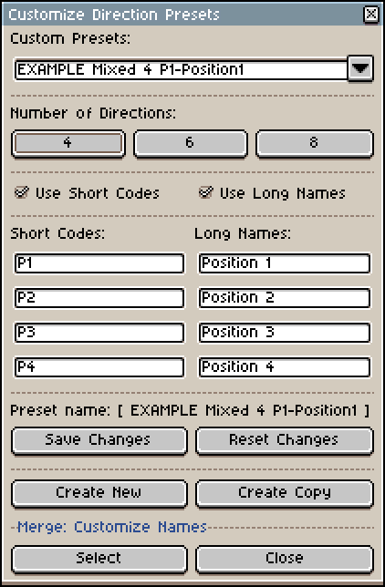

# Direction Name Presets

Direction presets consist of an ordered list of **short codes** and/or **long names**. A preset can have `4`, `6` or `8` directions.

The tool will try to parse any direction codes/names in the filenames and, when setting up new layer or tag names, may use the matched codes/names based on your [Customize Names](Merge-Advanced.md#customize-names-settings) settings. Additionally, it can sort the sprites for you if you use the [Sort sprites by filename](Merge-Advanced.md#sort-sprites-by-filename) along with a **Direction preset**.

*A sample default preset. The short codes are included in the sprite filenames while the imported tags may be renamed with the longer names.*

For reusability purposes, these direction tables are saved to their own preset file (a `.lua` file) which can be loaded in the [Advanced Merge](Merge-Advanced.md#name-layerstags-with-a-direction-name)  dialog to further parse the filenames of your source sprites: 

+ If your game or your naming convention only uses **short codes** (Ex: `E, N, W, S`) the table will have a column of short codes where each row is filled with one of those directions.
+ The same applies if you're using **long names** (Ex: `Down, Up, Right, Left`), except the table will only have a column of long names.
+ You can also have a mixed naming convention, where the filenames use a short code while your layers or tags may use more readable long names (Ex: `SE` for `South-East`, or `P7` for `Position7`). In this case, the table will have two columns, one for short codes and one for long names.

## A Note on file naming conventions

If you plan to use any **Direction Name Preset**, keep in mind the extension expects consistent filenames and a direction code/name to appear only once in the filename, usually around the middle or the end of the filename and it works best if the direction names are formatted with unambiguous names (for example, "SouthEast", no spaces, works better than "South East" since the space in between may cause the tool to mistake it with South or with East).

As mentioned elsewhere, the filename parsing capabilities of this extension are limited, probably due to my own lack of skills ;') and the fact the tool cannot account for all sorts of direction names or naming conventions out there, separator characters (underscores, spaces, dashes), etc. Some edge cases may be parsed incorrectly, so experiment and see what works best for you, and if all fails, revert to using the filenames to set your layer/tag names and skip the direction presets.

>Note that using [filenames for layer/tag names](Merge-Advanced.md#name-layerstags-with-sprite-filenames) is the most "neutral" of the naming settings (i.e., less error prone), along with the no sort or [alphabetically sort by filenames](Merge-Advanced.md#sort-sprites-by-filename) options.

## Default Direction Presets
The extension comes with a few presets with common direction names:
+ **Cardinal:** 4 [cardinal directions](https://en.wikipedia.org/wiki/Cardinal_direction).
	+ Short: `{S, E, N, W}`
	+ Long: `{South, East, North, West}`
	+ Mixed: `{S = South, E = East, N = North, W = West}`
+ **Ordinal:** 8 ordinal directions (or the 4 cardinal directions plus the diagonals).
	+ Short: `{S, SE, E, NE, N, NW, W, SW}`
	+ Long: `{South, SouthEast, East, NorthEast, North, NortWest, West, SouthWest}`
	+ Mixed: `{S = South, SE = SouthEast, E = East, NE = NorthEast, N = North, etc...}`
+ **Relative:** Relative directions, with versions for 4 and 8 directions.
	+ Short: `{D, R, U, L}`
	+ Long: `{Down, Right, Up, Left}`
	+ Mixed: `{D = Down, R = Right, U = Up, L = Left}`

>**NOTE:** All the directions in the default presets are ordered starting from the South position and go around counterclockwise. **You cannot modify default presets inside the application.** You may create a custom preset with similar codes/names or edit the file outside the application. You could also just copy-paste the file to the custom presets folder after modifying the corresponding values in the preset file. [This could break the tool](Merge-DirectionPresets.md#modifying-presets-outside-the-application), so do it with care.

## Custom Direction Presets
You can create your own custom direction presets to match your project or file naming convention.  A custom preset can have `4`, `6` or `8` directions and have only **short codes**, or **long names** or a combination of the two. These codes/names must be unique (that is, you cannot have two rows with the name, e.g., `Pos1`) and they cannot be empty.

*A sample custom preset.*

If, for instance, you were making a 2D platformer with only `2` directions, e.g., `Right, Left`, you could create a custom preset with 4 directions and fill the remaining rows with nonsense that you know won't appear anywhere in the filenames.

These custom presets could help you creatively organize your sprites not just in terms of direction names, for example, by adding specific keywords to layer/tag names you might not want to appear in the filenames. Though, as stated before, you would have much more flexibility and control over the filenames. Within Aseprite, there are 3rd party tools to [Bulk Rename Tags](https://github.com/jjhaggar/Aseprite-Add-on-Collections/tree/master/scripts/bulk-rename-tags) and TopDownTools' own [Bulk Layer Rename](Layers-BulkRename.md#bulk-rename-layers) feature.

The extension comes with a couple example presets. You should be able to safely delete their files (see [Paths](#paths)).

## Modifying presets outside the application
Though not entirely recommendable since the script depends on the structure, special characters and spacing of each preset's `.lua` file to run properly, you could modify these files by editing them in your text editor of choice. For example, you could create a copy of a default preset inside the custom presets folder to use as a template, and then further modify it in the text editor or inside the [Custom Presets](Merge-DirectionPresets.md#custom-direction-presets) dialog.

It's recommended to always save a backup of the file before editing it and reverting to this backup in case the application throws an error or the preset is not loaded correctly. Note that modifying the preset externally with the application running might cause different issues.

If you've modified a preset file and you suspect it might be corrupted because the tool cannot load or save it, or throws some nil or script error when trying to use it, remove the file and/or restart the application.

Here's a few important things to consider:
+ the field `presetName` needs to match the exact filename of the preset and, for all intents and purposes, it's case-sensitive. 
	+ Example: a preset file named `Cardinal 4 lowercase.lua` must have a corresponding **presetName** field `["presetName"]="Cardinal 4 lowercase"` and vice versa.
+ Custom presets should have the following field set to **false**: `["useDefaultDirNames"]=false`
+ The fields `useLongDirNames` and `useShortDirCodes` cannot be both **false** at the same time.
+ `useSingleDirectionNaming` must be **false** if you use a mixed naming convention, i.e., both `useLongDirNames` and `useShortDirCodes` equal **true**.  
+ `numberOfDirections` can only be filled with `4`, `6` or `8`. Other numbers may produce strange results.
+ The codes and long names are stored in two different arrays nested inside the preset table, `directionCodes` and `directionNames` respectively. If your preset has a single naming convention, only one of the two will appear. However, **an extra required array must exist**, a table named `directions` which serves as a lookup table:
	+  If using only **short codes**, the *keys* and the *values* should be the same.
		+ Ex: `{ ["R"]="R", ["U"]="U", ["D"]="D", ["L"]="L", }`.
	+ The same applies when using **long names** only.
		+ Ex: `{ ["Right"]="Right", ["Up"]="Up", ... }`
	+ If using a mixed naming convention, the keys correspond to the codes and the values to the long names.
		+ Ex: `{ ["R"]="Right", ["U"]="Up", ... }`

Since it's very easy to break a preset by an accidental mistake (a missing comma, an extra space somewhere, an incorrect capital letter), it's recommended to use the dialog tools to customize them.

### Paths:
The preset files can be found inside the extension's directory.
+ Default presets: `C:\Users\USERNAME\AppData\Roaming\Aseprite\extensions\topdown-tools\direction-presets\default`
+ Custom presets: `C:\Users\USERNAME\AppData\Roaming\Aseprite\extensions\topdown-tools\direction-presets\custom`
