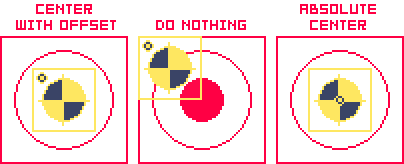

# Simple Merge
The Simple Merge process imports all open sprites into a single layer on a new sprite. It's a stripped-down version of the [Advanced Merge](Merge-Advanced.md#advanced-merge) dialog. 

All the frames from the source sprites are imported as a [sequence](Merge-Advanced.md#sequence-fanned-out). The image of each frame is imported as a [flattened image](Merge-Advanced.md#flatten-sprite-layers), which means it doesn't matter how its internal layers might be set up. This is similar to doing `Select All` and then `Edit -> Copy Merged` for each frame, pasting it into a new file, then repeating the process for the remaining frames for each source sprite.

You can access it from `File -> Merge Open Sprites (Simple)`.

### Demo

Watch a demo of this tool [here](./demos/Demo-Merge-Simple.md#simple-merge).

----

### A Note about Indexed sprites
If the source sprites to be merged are [Indexed](https://www.aseprite.org/docs/color-mode/#indexed) and all have the exact same palette (both in size and color order) the resulting new sprite will import that palette and you probably won't have to do anything else. 

However, if some of the colors or their indices don't match across every palette, or if some of the sprites are not indexed while others are, the resulting new sprite will not be Indexed and will have a blank palette. You can later import or create a palette manually and set the new sprite to Indexed mode.

## Settings:

### Sort sprites by filename
By default, the source sprites will be processed in whatever order they were opened in Aseprite. If this setting is enabled, the extension will attempt to alphabetically sort the sprites by filename and will process them in that order. 

### Copy framerate
This option allows you to copy the framerate of each individual frame from the source sprites.

### Add Delimiting Tags
Adds [tags](https://www.aseprite.org/docs/tags/) to the new sprite to show where each source sprite is in the timeline. By default, these tags will be named with the filename of each source sprite. If you need to customize these tag names, try the Advanced Merge process, specifically the [Customize Names](Merge-Advanced.md#customize-names-settings) feature.

### Import Tags
Copies every [tag](https://www.aseprite.org/docs/tags/) found in each source sprite into the new sprite. It copies tag names, tag colors and animation directions. The imported tags should be automatically placed in the corresponding frames.

## Canvas Size settings

When importing sprites with different dimensions, the canvas size of the new sprite will be enlarged to accommodate all the source sprites. The Canvas Size panel allows you to change the position of the smaller source sprites: 

+ **Center with offset:** Center the imported images but, visually, the different shapes will retain their original offset.
+ **Do nothing:** The imported images will be positioned around the top left corner `(x=0, y=0)`.

  
Click to show an illustrative example

 
+ Sprite A (32x32):

+ Sprite B (64x64):

+ Merge results:

Note that this panel will not appear if all the source sprites share the same dimensions and that the **Absolute Center** feature in the above illustration is not available in the Simple Merge process (only works when importing layer structure via the [Advanced Merge](Merge-Advanced.md#canvas-size-settings) tool).