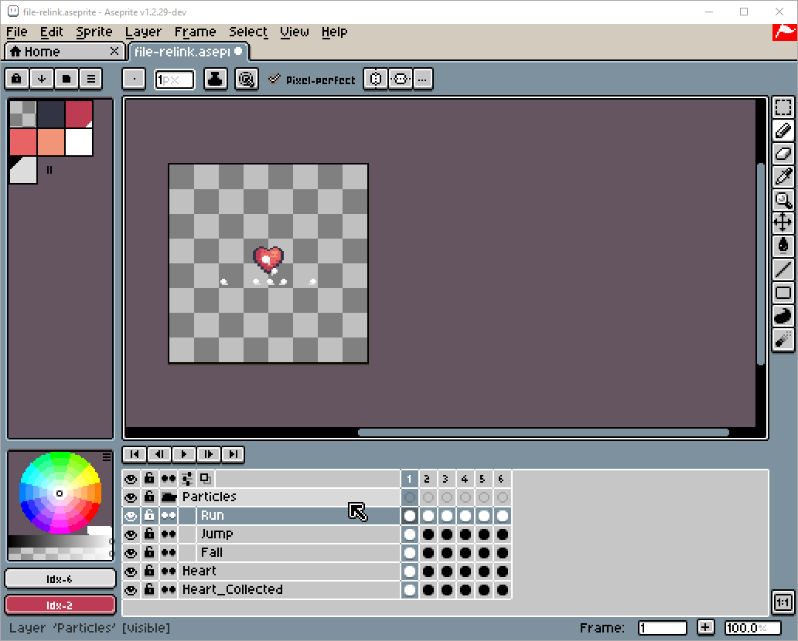

# Re-Link All Cels

A script to [re-link cels](https://www.aseprite.org/docs/linked-cels/) based on different settings. It finds all identical cels that share the same image at the exact same position and links them.

Useful to tidy up your animations, when importing a spritesheet that has repeating frames or after importing a sprite with the [Simple](Merge-Simple.md#simple-merge) or [Advanced Merge](Merge-Advanced.md#advanced-merge) tools (as either process will not maintain the links between imported cels).

It can be accessed through `Frame -> Re-Link All Cels`.

### Demo

*Sample assets created by [Pixel Frog](https://pixelfrog-assets.itch.io/pirate-bomb).*

## Link settings:

+ **Only in [continuous layers](https://www.aseprite.org/docs/continuous-layers/):** Enabled by default

+ **Only in visible layers**: Note that visible sublayers will be considered hidden if their parent group is hidden.

+ **Set layer to continuous if it contains linked cels:** 
>**NOTE:** Changing a layer to continuous manually or via script does not generate Undo information by Aseprite's design (see reported [issue](https://github.com/aseprite/aseprite/issues/2991)), so the result of this setting cannot be undone. This may change in future versions. 

+ **Match cel appeareance and metadata:** Cels can have specific colors in the timeline or custom user data. Enabling this setting allows you to filter cels not only by identical appeareance but also by identical timeline UI colors and user data: two cels with the same image will not be linked together unless they share the same color/user data.

*Cels can have colors and user data*